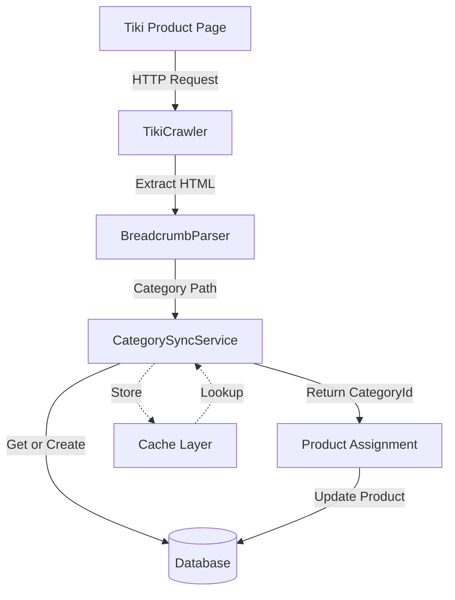
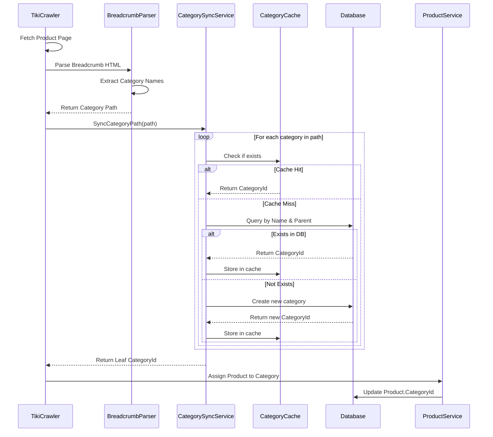

# Design Document

## Overview

This design implements a robust system for extracting, parsing, and synchronizing Tiki's hierarchical product categories through breadcrumb navigation. The solution extends the existing `TikiCrawler` service to extract breadcrumb data from product pages and introduces a new `CategorySyncService` that implements the get-or-create algorithm to maintain category hierarchy in the database without duplicates.

The system follows a three-phase approach:
1. **Extraction Phase**: Parse breadcrumb HTML from Tiki product pages
2. **Synchronization Phase**: Process breadcrumb paths and sync with database using transactional operations
3. **Assignment Phase**: Link products to their leaf categories

## Architecture

### High-Level Architecture



### Component Interaction Flow



## Components and Interfaces

### 1. BreadcrumbParser

**Purpose**: Extract and parse breadcrumb navigation from Tiki product HTML/JSON.

**Interface**:
```csharp
public interface IBreadcrumbParser
{
    /// <summary>
    /// Parses breadcrumb data from Tiki API response
    /// </summary>
    /// <param name="jsonContent">JSON response from Tiki API</param>
    /// <returns>Ordered list of category names from root to leaf</returns>
    List<string> ParseBreadcrumbFromJson(string jsonContent);
    
    /// <summary>
    /// Parses breadcrumb from HTML (fallback method)
    /// </summary>
    /// <param name="htmlContent">HTML content of product page</param>
    /// <returns>Ordered list of category names from root to leaf</returns>
    List<string> ParseBreadcrumbFromHtml(string htmlContent);
}
```

**Implementation Details**:
- Primary method: Parse from Tiki API JSON response (field: `breadcrumbs` or `categories`)
- Fallback method: Parse from HTML using CSS selectors (`.breadcrumb`, `[itemtype="http://schema.org/BreadcrumbList"]`)
- Handle Unicode characters (Vietnamese text)
- Trim whitespace and normalize category names
- Return empty list if no breadcrumb found (will use default category)

### 2. CategorySyncService

**Purpose**: Implement get-or-create algorithm for category synchronization with caching and transaction support.

**Interface**:
```csharp
public interface ICategorySyncService
{
    /// <summary>
    /// Synchronizes a category path and returns the leaf category ID
    /// </summary>
    /// <param name="categoryPath">Ordered list of category names from root to leaf</param>
    /// <param name="cancellationToken">Cancellation token</param>
    /// <returns>CategoryId of the leaf category</returns>
    Task<int> SyncCategoryPathAsync(List<string> categoryPath, CancellationToken cancellationToken = default);
    
    /// <summary>
    /// Gets or creates a single category with specified parent
    /// </summary>
    /// <param name="categoryName">Name of the category</param>
    /// <param name="parentCategoryId">Parent category ID (null for root)</param>
    /// <param name="cancellationToken">Cancellation token</param>
    /// <returns>CategoryId of the category</returns>
    Task<int> GetOrCreateCategoryAsync(string categoryName, int? parentCategoryId, CancellationToken cancellationToken = default);
    
    /// <summary>
    /// Clears the category cache
    /// </summary>
    void ClearCache();
}
```

**Implementation Details**:
- Use `IMemoryCache` for caching category lookups
- Cache key format: `"category:{name}:{parentId}"`
- Cache expiration: 1 hour (sliding)
- Transaction scope: Wrap entire path sync in database transaction
- Concurrency handling: Use database unique constraints and catch duplicate key exceptions
- Logging: Log all create operations at Info level, lookups at Debug level

### 3. Enhanced TikiCrawler

**Purpose**: Extend existing crawler to extract and process breadcrumb data.

**Modified Interface**:
```csharp
public class CrawledProduct
{
    // ... existing properties ...
    
    /// <summary>
    /// Breadcrumb category path from root to leaf
    /// </summary>
    public List<string> CategoryPath { get; set; } = new List<string>();
    
    /// <summary>
    /// The leaf category ID after synchronization
    /// </summary>
    public int? CategoryId { get; set; }
}
```

**Implementation Changes**:
- Inject `IBreadcrumbParser` and `ICategorySyncService`
- After parsing product data, extract breadcrumb
- Call `SyncCategoryPathAsync` to get category ID
- Include category ID in returned `CrawledProduct`

### 4. CategoryQueryService

**Purpose**: Provide advanced querying capabilities for category hierarchies.

**Interface**:
```csharp
public interface ICategoryQueryService
{
    /// <summary>
    /// Gets all products in a category and its descendants
    /// </summary>
    Task<List<Product>> GetProductsInCategoryTreeAsync(int categoryId, CancellationToken cancellationToken = default);
    
    /// <summary>
    /// Gets the full path from root to specified category
    /// </summary>
    Task<List<Category>> GetCategoryPathAsync(int categoryId, CancellationToken cancellationToken = default);
    
    /// <summary>
    /// Gets category statistics including product counts
    /// </summary>
    Task<CategoryStatistics> GetCategoryStatisticsAsync(int categoryId, bool includeDescendants = true, CancellationToken cancellationToken = default);
    
    /// <summary>
    /// Gets all descendant categories of a parent
    /// </summary>
    Task<List<Category>> GetDescendantCategoriesAsync(int parentCategoryId, CancellationToken cancellationToken = default);
}
```

## Data Models

### Existing Category Model (No Changes Required)

The existing `Category` model already supports the required hierarchy:

```csharp
public class Category
{
    public int CategoryId { get; set; }
    public string CategoryName { get; set; }
    public int? ParentCategoryId { get; set; }
    public string IconUrl { get; set; }
    public DateTime? CreatedAt { get; set; }
    
    // Navigation properties
    public virtual Category ParentCategory { get; set; }
    public virtual ICollection<Category> SubCategories { get; set; }
}
```

### Existing Product Model (Already Has CategoryId)

The `Product` model already has the required foreign key:

```csharp
public class Product
{
    // ... other properties ...
    public int? CategoryId { get; set; }
    
    [ForeignKey("CategoryId")]
    public virtual Category? Category { get; set; }
}
```

### New DTO: CategoryStatistics

```csharp
public class CategoryStatistics
{
    public int CategoryId { get; set; }
    public string CategoryName { get; set; }
    public int DirectProductCount { get; set; }
    public int TotalProductCount { get; set; } // Including descendants
    public int DescendantCategoryCount { get; set; }
    public int Depth { get; set; }
    public List<string> PathFromRoot { get; set; }
}
```

### Database Constraints

Add unique constraint to prevent duplicate categories with same name under same parent:

```sql
CREATE UNIQUE NONCLUSTERED INDEX IX_Categories_Name_Parent 
ON Categories(CategoryName, ParentCategoryId) 
WHERE ParentCategoryId IS NOT NULL;

CREATE UNIQUE NONCLUSTERED INDEX IX_Categories_Name_Root 
ON Categories(CategoryName) 
WHERE ParentCategoryId IS NULL;
```

## Correctness Properties

*A property is a characteristic or behavior that should hold true across all valid executions of a system-essentially, a formal statement about what the system should do. Properties serve as the bridge between human-readable specifications and machine-verifiable correctness guarantees.*

### Property 1: Breadcrumb extraction preserves order
*For any* Tiki product page with a valid breadcrumb, parsing the breadcrumb should return categories in the exact order they appear from root to leaf
**Validates: Requirements 1.2**

### Property 2: Category uniqueness within parent
*For any* category name and parent ID combination, there should exist at most one category record in the database with that exact combination
**Validates: Requirements 3.2**

### Property 3: Get-or-create idempotence
*For any* category path, calling `SyncCategoryPathAsync` multiple times should always return the same leaf category ID without creating duplicates
**Validates: Requirements 3.3, 3.4**

### Property 4: Transaction atomicity
*For any* category path sync operation, if any database operation fails, then no categories from that operation should persist in the database
**Validates: Requirements 4.1, 4.2**

### Property 5: Parent-child relationship consistency
*For any* category with a non-null ParentCategoryId, the parent category must exist in the database
**Validates: Requirements 2.1, 2.2**

### Property 6: Category path completeness
*For any* product with a CategoryId, traversing from that category to the root through parent relationships should never encounter a null parent before reaching a root category
**Validates: Requirements 2.5**

### Property 7: Cache consistency
*For any* category lookup, the cached result should match the database state at the time of caching
**Validates: Requirements 8.2**

### Property 8: Product assignment correctness
*For any* scraped product with a valid breadcrumb, the product's CategoryId should reference the leaf category from the breadcrumb path
**Validates: Requirements 5.1, 5.2**

### Property 9: Concurrent sync safety
*For any* two concurrent sync operations processing the same category path, both should complete successfully and reference the same category IDs
**Validates: Requirements 4.5**

### Property 10: Unicode handling correctness
*For any* category name containing Unicode characters (Vietnamese text), the stored and retrieved category name should be identical to the original
**Validates: Requirements 1.3**

## Error Handling

### Error Scenarios and Responses

| Scenario | Error Type | Handling Strategy | User Impact |
|----------|-----------|-------------------|-------------|
| Breadcrumb not found | Warning | Assign to "Uncategorized" category | Product still saved, categorized as uncategorized |
| Invalid JSON/HTML | Warning | Log and skip breadcrumb processing | Product saved without category |
| Database connection failure | Error | Retry 3 times with exponential backoff | Operation fails, logged for retry |
| Duplicate key violation | Info | Catch exception, query existing record | No impact, existing category used |
| Transaction timeout | Error | Rollback and retry once | Temporary delay, eventual success |
| Cache eviction | Info | Query database on cache miss | Slight performance impact |
| Null/empty category name | Warning | Skip that level, continue with next | Partial path processed |
| Circular parent reference | Error | Reject operation, log critical error | Operation fails, requires manual fix |

### Logging Strategy

**Log Levels**:
- **Debug**: Cache hits, existing category found
- **Info**: New category created, sync completed successfully
- **Warning**: Breadcrumb not found, partial path processed
- **Error**: Database failures, transaction rollbacks
- **Critical**: Data integrity issues (circular references)

**Log Format**:
```
[{Timestamp}] [{Level}] [{Component}] {Message}
Context: {ContextData}
```

**Example Logs**:
```
[2024-12-02 10:15:23] [Info] [CategorySyncService] Created new category
Context: { CategoryName: "Samsung TV", ParentId: 42, CategoryId: 156 }

[2024-12-02 10:15:24] [Debug] [CategorySyncService] Category found in cache
Context: { CategoryName: "Electronics", ParentId: null, CategoryId: 1 }

[2024-12-02 10:15:25] [Warning] [BreadcrumbParser] Breadcrumb not found in product page
Context: { ProductUrl: "https://tiki.vn/product-p123.html", ProductId: "123" }
```

## Testing Strategy

### Unit Testing

**BreadcrumbParser Tests**:
- Test parsing valid JSON with breadcrumb array
- Test parsing HTML with breadcrumb schema markup
- Test handling missing breadcrumb (returns empty list)
- Test Unicode character handling (Vietnamese text)
- Test malformed JSON/HTML (graceful failure)
- Test whitespace trimming and normalization

**CategorySyncService Tests**:
- Test creating new category path (all new)
- Test syncing existing category path (all exist)
- Test mixed path (some exist, some new)
- Test cache hit scenarios
- Test cache miss scenarios
- Test concurrent access with same category
- Test transaction rollback on error
- Test null/empty category name handling

**CategoryQueryService Tests**:
- Test getting products from category tree
- Test building category path to root
- Test calculating statistics with descendants
- Test handling categories with no products
- Test deep hierarchy traversal (10+ levels)

### Property-Based Testing

The property-based testing library for C# is **FsCheck** (or **CsCheck** as an alternative). Tests should run a minimum of 100 iterations.

**Property Test 1: Breadcrumb order preservation**
```csharp
// Feature: tiki-category-breadcrumb-scraping, Property 1: Breadcrumb extraction preserves order
[Property(MaxTest = 100)]
public Property BreadcrumbOrderIsPreserved()
{
    return Prop.ForAll(
        GenerateCategoryPath(),
        categoryPath =>
        {
            var json = CreateTikiJsonWithBreadcrumb(categoryPath);
            var parser = new BreadcrumbParser();
            var result = parser.ParseBreadcrumbFromJson(json);
            return result.SequenceEqual(categoryPath);
        });
}
```

**Property Test 2: Category uniqueness**
```csharp
// Feature: tiki-category-breadcrumb-scraping, Property 2: Category uniqueness within parent
[Property(MaxTest = 100)]
public async Task<Property> CategoryUniquenessIsEnforced()
{
    return await Prop.ForAllAsync(
        GenerateCategoryName(),
        GenerateParentId(),
        async (name, parentId) =>
        {
            var service = CreateCategorySyncService();
            var id1 = await service.GetOrCreateCategoryAsync(name, parentId);
            var id2 = await service.GetOrCreateCategoryAsync(name, parentId);
            return id1 == id2;
        });
}
```

**Property Test 3: Sync idempotence**
```csharp
// Feature: tiki-category-breadcrumb-scraping, Property 3: Get-or-create idempotence
[Property(MaxTest = 100)]
public async Task<Property> SyncIsIdempotent()
{
    return await Prop.ForAllAsync(
        GenerateCategoryPath(),
        async categoryPath =>
        {
            var service = CreateCategorySyncService();
            var id1 = await service.SyncCategoryPathAsync(categoryPath);
            var id2 = await service.SyncCategoryPathAsync(categoryPath);
            var id3 = await service.SyncCategoryPathAsync(categoryPath);
            return id1 == id2 && id2 == id3;
        });
}
```

**Property Test 4: Transaction atomicity**
```csharp
// Feature: tiki-category-breadcrumb-scraping, Property 4: Transaction atomicity
[Property(MaxTest = 100)]
public async Task<Property> TransactionIsAtomic()
{
    return await Prop.ForAllAsync(
        GenerateCategoryPath(),
        async categoryPath =>
        {
            var service = CreateCategorySyncServiceWithFailure();
            var initialCount = await GetCategoryCount();
            
            try
            {
                await service.SyncCategoryPathAsync(categoryPath);
            }
            catch
            {
                // Expected failure
            }
            
            var finalCount = await GetCategoryCount();
            return initialCount == finalCount; // No partial commits
        });
}
```

**Property Test 5: Parent-child consistency**
```csharp
// Feature: tiki-category-breadcrumb-scraping, Property 5: Parent-child relationship consistency
[Property(MaxTest = 100)]
public async Task<Property> ParentChildRelationshipIsConsistent()
{
    return await Prop.ForAllAsync(
        GenerateCategoryPath(),
        async categoryPath =>
        {
            var service = CreateCategorySyncService();
            await service.SyncCategoryPathAsync(categoryPath);
            
            // Verify all non-root categories have valid parents
            var categories = await GetAllCategories();
            return categories
                .Where(c => c.ParentCategoryId.HasValue)
                .All(c => categories.Any(p => p.CategoryId == c.ParentCategoryId));
        });
}
```

**Property Test 6: Path completeness**
```csharp
// Feature: tiki-category-breadcrumb-scraping, Property 6: Category path completeness
[Property(MaxTest = 100)]
public async Task<Property> CategoryPathIsComplete()
{
    return await Prop.ForAllAsync(
        GenerateCategoryPath(),
        async categoryPath =>
        {
            var service = CreateCategorySyncService();
            var leafId = await service.SyncCategoryPathAsync(categoryPath);
            
            var queryService = CreateCategoryQueryService();
            var path = await queryService.GetCategoryPathAsync(leafId);
            
            // Path should reach root without null parents
            return path.Count > 0 && path.Last().ParentCategoryId == null;
        });
}
```

**Property Test 7: Cache consistency**
```csharp
// Feature: tiki-category-breadcrumb-scraping, Property 7: Cache consistency
[Property(MaxTest = 100)]
public async Task<Property> CacheIsConsistentWithDatabase()
{
    return await Prop.ForAllAsync(
        GenerateCategoryName(),
        GenerateParentId(),
        async (name, parentId) =>
        {
            var service = CreateCategorySyncService();
            var cachedId = await service.GetOrCreateCategoryAsync(name, parentId);
            
            service.ClearCache();
            
            var dbId = await service.GetOrCreateCategoryAsync(name, parentId);
            return cachedId == dbId;
        });
}
```

**Property Test 8: Product assignment correctness**
```csharp
// Feature: tiki-category-breadcrumb-scraping, Property 8: Product assignment correctness
[Property(MaxTest = 100)]
public async Task<Property> ProductIsAssignedToLeafCategory()
{
    return await Prop.ForAllAsync(
        GenerateCategoryPath(),
        async categoryPath =>
        {
            var syncService = CreateCategorySyncService();
            var leafId = await syncService.SyncCategoryPathAsync(categoryPath);
            
            var product = CreateTestProduct();
            product.CategoryId = leafId;
            await SaveProduct(product);
            
            var savedProduct = await GetProduct(product.ProductId);
            return savedProduct.CategoryId == leafId;
        });
}
```

**Property Test 9: Concurrent sync safety**
```csharp
// Feature: tiki-category-breadcrumb-scraping, Property 9: Concurrent sync safety
[Property(MaxTest = 100)]
public async Task<Property> ConcurrentSyncIsSafe()
{
    return await Prop.ForAllAsync(
        GenerateCategoryPath(),
        async categoryPath =>
        {
            var service1 = CreateCategorySyncService();
            var service2 = CreateCategorySyncService();
            
            var task1 = service1.SyncCategoryPathAsync(categoryPath);
            var task2 = service2.SyncCategoryPathAsync(categoryPath);
            
            var results = await Task.WhenAll(task1, task2);
            return results[0] == results[1];
        });
}
```

**Property Test 10: Unicode handling**
```csharp
// Feature: tiki-category-breadcrumb-scraping, Property 10: Unicode handling correctness
[Property(MaxTest = 100)]
public async Task<Property> UnicodeIsHandledCorrectly()
{
    return await Prop.ForAllAsync(
        GenerateVietnameseCategoryName(),
        async categoryName =>
        {
            var service = CreateCategorySyncService();
            var categoryId = await service.GetOrCreateCategoryAsync(categoryName, null);
            
            var category = await GetCategory(categoryId);
            return category.CategoryName == categoryName;
        });
}
```

### Test Data Generators

```csharp
// Generator for category paths (1-5 levels deep)
public static Arbitrary<List<string>> GenerateCategoryPath()
{
    return Arb.From(
        Gen.ListOf(1, 5, Gen.Elements(
            "Electronics", "TV", "Samsung TV", "4K TV",
            "Điện thoại", "iPhone", "Laptop", "Máy tính",
            "Thời trang", "Giày dép", "Túi xách"
        ))
    );
}

// Generator for Vietnamese category names
public static Arbitrary<string> GenerateVietnameseCategoryName()
{
    return Arb.From(
        Gen.Elements(
            "Điện tử", "Thời trang nam", "Đồ gia dụng",
            "Sách tiếng Việt", "Mỹ phẩm", "Đồ chơi trẻ em"
        )
    );
}

// Generator for parent IDs (null or 1-100)
public static Arbitrary<int?> GenerateParentId()
{
    return Arb.From(
        Gen.Frequency(
            Tuple.Create(1, Gen.Constant<int?>(null)),
            Tuple.Create(4, Gen.Choose(1, 100).Select(x => (int?)x))
        )
    );
}
```

### Integration Testing

- Test end-to-end flow: Tiki URL → Crawl → Parse → Sync → Assign
- Test with real Tiki product URLs (sample set)
- Test database transaction rollback scenarios
- Test cache behavior under load
- Test concurrent crawler instances

### Performance Testing

- Benchmark category sync with 1000 products
- Measure cache hit rate over time
- Test deep hierarchy performance (10+ levels)
- Measure transaction overhead
- Test bulk sync operations (100+ products)

## Implementation Notes

### Cache Strategy

- Use `IMemoryCache` with sliding expiration (1 hour)
- Cache key format: `"cat:{name}:{parentId ?? 0}"`
- Eviction policy: LRU (built into IMemoryCache)
- Cache size limit: 10,000 entries
- Clear cache on application restart

### Transaction Management

- Use `IDbContextTransaction` for explicit transactions
- Isolation level: `ReadCommitted`
- Timeout: 30 seconds
- Retry policy: 1 retry on deadlock or timeout

### Concurrency Handling

- Rely on database unique constraints
- Catch `DbUpdateException` for duplicate key violations
- On duplicate: Query existing record and return its ID
- No application-level locking required

### Performance Optimizations

1. **Batch Operations**: Process multiple products in parallel
2. **Index Usage**: Ensure indexes on `CategoryName` and `ParentCategoryId`
3. **Query Optimization**: Use `AsNoTracking()` for read-only queries
4. **Connection Pooling**: Leverage EF Core connection pooling
5. **Async/Await**: Use async methods throughout

### Migration Path

1. Add unique constraints to Categories table
2. Deploy new services (backward compatible)
3. Update TikiCrawler to use new services
4. Backfill existing products with categories (optional)
5. Monitor logs for errors and adjust

## Dependencies

- **Microsoft.Extensions.Caching.Memory**: For category caching
- **Microsoft.EntityFrameworkCore**: For database operations
- **HtmlAgilityPack**: For HTML parsing (already in use)
- **System.Text.Json**: For JSON parsing (already in use)
- **FsCheck** or **CsCheck**: For property-based testing
- **xUnit** or **NUnit**: For unit testing framework

## Security Considerations

- **SQL Injection**: Use parameterized queries (EF Core handles this)
- **Input Validation**: Sanitize category names (max length, allowed characters)
- **Rate Limiting**: Respect Tiki's rate limits when crawling
- **Error Disclosure**: Don't expose internal errors to external callers

## Monitoring and Observability

### Metrics to Track

- Categories created per hour
- Cache hit rate
- Average sync time per product
- Transaction rollback rate
- Breadcrumb extraction failure rate

### Alerts

- Alert if breadcrumb extraction fails > 10% of requests
- Alert if transaction rollback rate > 5%
- Alert if cache hit rate < 70%
- Alert if sync time > 1 second (p95)

### Dashboards

- Category growth over time
- Product distribution by category
- Sync performance metrics
- Error rate trends
